# Javabackend

JavaWeb 后端开发技术，也就是学习 JavaEE (Enterprise Edition) 版本；是一种结构和一套标准。在应用中开发的标准就是我们接下来要学习的 Servlet、jsp 和 JavaBean技术。web后端开发，基于B/S模式的开发体系。

> jsp技术现在已基本处于淘汰状态，只做简单介绍，不做系统讲述 👀️

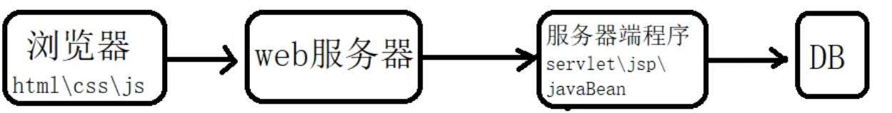

# 一、SeverLet

> server + let
>
> - servlet 基于java技术的web组件，使用java编写的服务器端程序;
> - 实现了 ServletAPI 规范的 java 应用程序就是 Servlet;
> - 主要是用来处理来自web浏览器或者其他http客户端的请求，动态的生成内容给到客户端进行响应;
> - servlet 和大多数的 java 组件一样，是和平台无关性的组件;
> - 可以被编译成机器字节码被基于 java 技术的 web 服务器加载和运行;

要部署和运行 servlet，需要使用 web容器(服务器)，web容器本质上就是与 servlet 交互的 web 服务器组件，负责管理 servlet 生命周期，将 URL 映射到特定的 servlet，并确保 URL 请求者具有正确的权限。

> - 以浏览器作为展示客户端界面的窗口客户端界面表现为网页形式;
> - 一般由html语言、jsp、vue等前端框架写成;
> - 客户端和服务器可以进行业务相关的动态交互;
> - 可以完成类似于桌面应用程序的功能;
> - 使用浏览器/服务器架构(Browser/Server)，采用 http 协议进行通信;
> - web应用通过web服务器来发布;

## 1. Tomcat 服务器

> - tomcat 是在 oracle 公司的 JSWDK(avaServer Web DelevopmentKit)的基础上发展起来的一个优秀的开源的 servlet 容器;
> - tomcat 使用 java 语言编写。运行稳定、可靠、效率高，可以和目前 主流web服务器一起工作(如IIS、Apache、Nginx);
> - tomcat 是 Apache 软件基金会(Apache Software Foundation)的Jakarta项目中一个核心项目;
> - 属于轻量级应用服务器，在中小型系统和并发访问用户量不是很多的场合下应用;

### （1）下载和安装

> 官网: https://tomcat.apache.org/
> 下载地址: https://tomcat.apache.org/download-90.cgi

安装后访问：http://localhost:8080/，即安装成功

### （2）Tomcat 目录结构

目录：

- bin 目录: 主要存储 tomcat 的相关指令，存放.bat文件(windows批处理文件) / .sh ;
- conf 目录: 主要用来存放 tomcat 的配置文件;
- lib 目录: 所有部署在 tomcat 中的 web 应用公用的 jar 包;
- logs 目录: 保存 tomcat 日志数据;
- temp 目录: 存放 tomcat 运行期间产生的临时文件;
- webapps 目录: tomcat 默认的项目部署目录，可以放未打包的目录，也可以存放打成 war 包的目录 :star:
- work 目录: 用来存放 jsp 转译成 java，再进行编译后的 class 文件;

文件：

- LICENSE: tomcat 开源许可文件；
- NOTICE: tomcat 说明文件；
- RELEASE-NOTES: 版本说明文件；

### （3）Tomcat 启动和停止

启动三种方式：

- 运行 startup.bat 文件
- 运行 tomcat9.exe 文件
- 运行 tomcat9w.exe 文件 （带用户界面的程序）

停止：

- 关闭窗体
- ctrl + c
- 运行 shutdown.bat 文件

> tomcat 启动乱码问题解决:
>
> \Tomcat 9.0\conf\logging.properties，修改日志输出配置
>
> 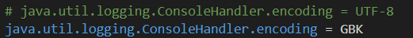
>
> 

### （4）Tomcat 用户配置

\Tomcat 9.0\conf\tomcat-users.xml 文件配置

```html
<role rolename="manager"/>
<role rolename="manager-gui"/>
<role rolename="admin"/>
<role rolename="admin-gui"/>
<user username="tomcat" password="tomcat" roles="manager, manager-gui, admin, admin-gui"/>
```

访问 http://localhost:8080

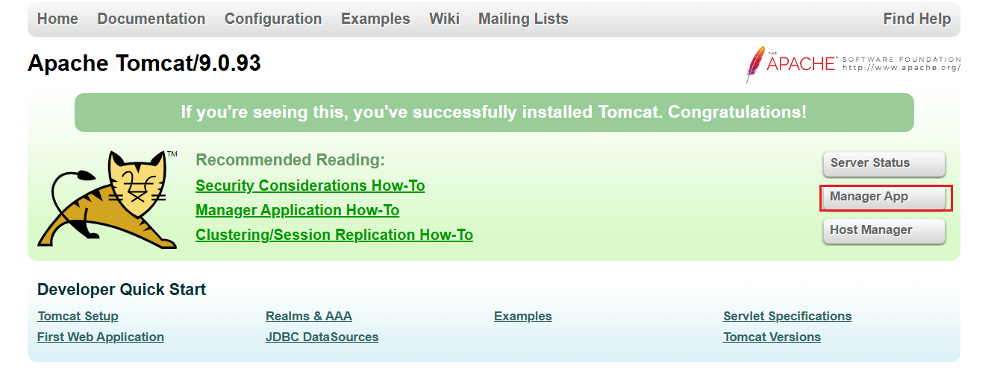

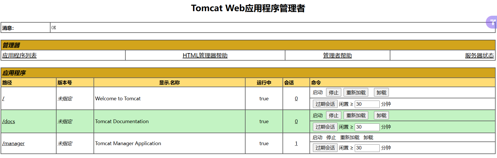

### （5）IDEA 集成 Tomcat 配置

1. 添加配置

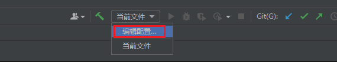

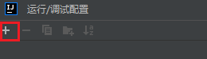

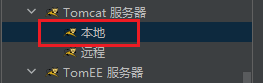

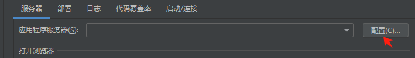

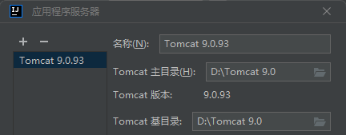


2. 启动与停止

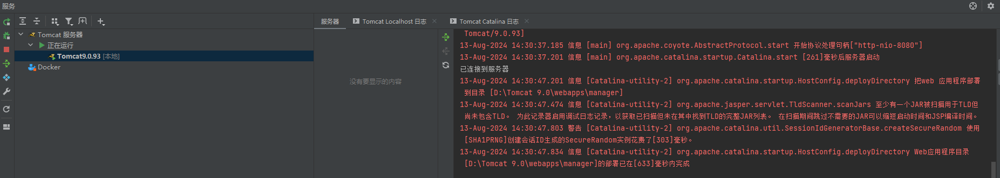

## 2. 留言板（入门）

### （1）IDEA 下创建 Web 工程

1. 创建一个 java 模块；
2. 右键该模块下拉，添加 web 支持；

   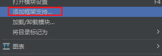
3. 添加 web 应用程序

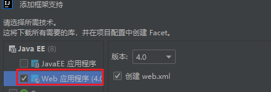

4. 在 WEB-INF 文件夹下 创建 lib 目录：用于存放当前工程所使用主要 jar 包

> - src: 存放 servlet 程序；
> - web：存放 css/html/jsp 图片等；

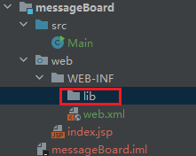

5. 配置 lib 为 jar 目录

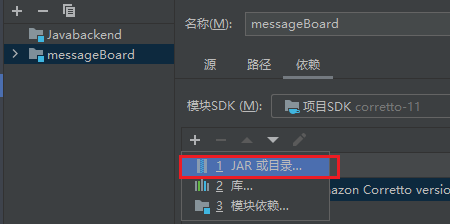

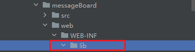

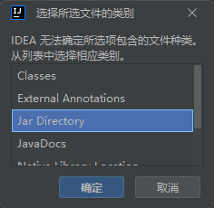

> 因此，后续添加到 lib 的 jar包，都会被自动识别

6. 配置文件编码 为 UTF-8；
7. 配置 Tomcat; (如前所述) 🔴
8. 将 Tomcat 库加入项目依赖中；

   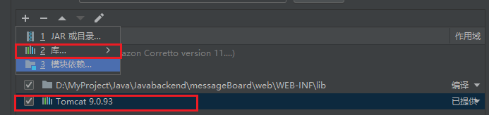

> 这会把当前 tamcat 所用到的 jar 包都导入到当前项目中来；

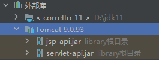

10. 创建 servlet 测试 （留言板前端） ⭐️

> web 目录下创建 message.html 文件

```html
<!DOCTYPE html>
<html lang="en">
<head>
    <meta charset="UTF-8">
    <title>Title</title>
</head>
<body>
<form action="" method="post">
    <div>
        昵称：
        <input type="text" name="nickName">
    </div>
    <div>
        留言：
        <textarea name="content"></textarea>
    </div>
    <div>
        <button type="submit">提交留言</button>
    </div>
</form>
</body>
</html>
```

12. 添加工件

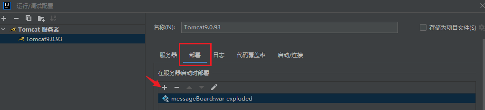

> 启动后默认访问 index.jsp, 访问 http://localhost:8080/message/message.html 可以访问到 message.html
>
> 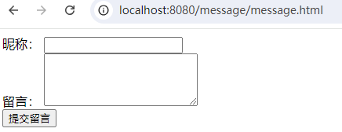

### （2）留言板（后端）

1. 创建 servlet 程序

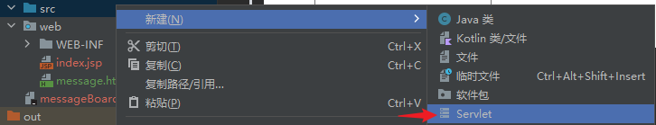

2. 前后端对应


#### a. 请求与响应

> - 请求：HttpServletRequest request
> - 响应：HttpServletResponse response
>
> 主要用于前后端之间的数据传递

```java
        // 设置响应内容类型是网页
        response.setContentType("text/html");
        // 设置响应编码
        response.setCharacterEncoding("utf-8");
        // 获取打印流
        PrintWriter out = response.getWriter();
        out.println("您的昵称是：" + nickName + "<br>"); // br实现换行
        out.println("您的留言是：" + content);
```

#### b. 留言板保存功能

#### c. 留言板查看功能

如果是直接在 URL 地址上访问一个 Servlet 路径，调用 doGet 方法，如果是通过超链接，访问的 Servlet 路径，也是调用 doGet 方法；

> ❤️ xxxServlet 类用于处理业务逻辑
>
> 1. 创建类，命名规则：`xxxServlet`；
> 2. 继承 `HttpServlet` 类，并重写 `doPost`&`doGet` 方法；
> 3. 使用类注解，定义名称和路径 `@WebServlet(name = "ViewMessageBoardServlet", value = "/view")`

## 3. Servlet API

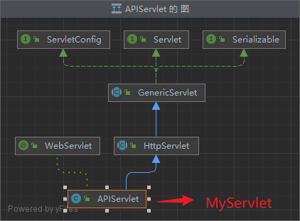

> 继承 HttpServlet 类，通常只需要重写 doGet() 和 doPost()方法

- HttpServlet 继承 GenericServlet；
- GenericServlet 实现了 Servlet 接口，ServletConfig 接口, Serializable 接口；
- 自定义 Servlet 继承 HttpServlet；

### （1）Servlet 生命周期

> Servlet 接口，有三个方法关乎 Servlet 的生命周期（从上到下是调用顺序）
>
> - 构造方法
> - init
> - service
> - destroy

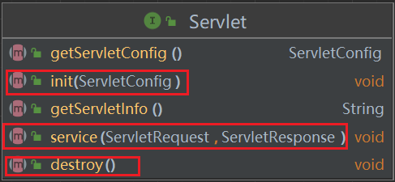

生命周期： ❤️

- 第一步：容器加载 Servlet；
- 第二步: 调用 Servlet 的无参构造方法，实例化；
- 第三步: 调用 init() 方法，完成初始化操作 (在servlet生命周期中，只执行一次)；
- 第四步: 调用 service() 方法，处理浏览端发送的请求，(HttpServlet中，可以调用 doGet 或 doPost)；
- 第五步: 调用 destroy() 方法，销毁线程；

### （2）Servlet 执行过程

> Servet 放在容器中(Tomcat)执行的，用户编写好程序后，部署在容器中，就可以了

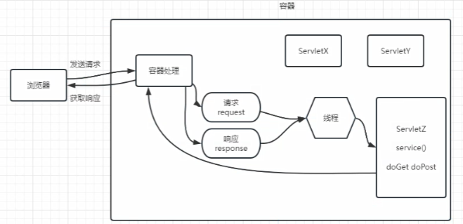

1. 浏览器向服务器发送请求，带着访问的 url 地址(即访问哪一个Servlet，即相应的路径);
2. 服务器处理部分接收，根据 url 找到对应的 Servet，产生两个对象: 请求和响应;
3. 创建一个线程，由访线程去访问对应的 Servlet;
4. 调用 Servlet 中的 doGet 或者是 doPost 方法，去完成用户的请求;
5. 将处理结果返回给服务器;
6. 服务器将响应返回给浏览器端;
7. 线程被销毁或放在线程池中;

### （3）Servlet 是线程非安全的

> Servlet 在默认情况下是线程不安全的。这是因为 Servlet 容器（如Tomcat）为了提高性能，通常会对 Servlet 实例进行重用，并采用多线程的方式处理并发的 HTTP 请求。这意味着同一个 Servlet 实例的方法可能会被多个线程同时调用。 ❤️
>
> - 默认每个 Servlet 只创建一个实例；
> - 多线程处理用户 Http 请求；
> - 同一个 Servlet 实例的方法可能会被多个线程同时调用；

## 4. Http 协议

- Http 是基于 TCP/IP 协议之上的应用层协议；
- 使用 请求-响应 模式；
- 请求从客户端浏览器发出，由服务器端响应该请求，并返回给浏览器端；
- 无状态: 自身不对请求和响应之间的通信状态进行保存；
- 无连接: 限制每次连接只处理一个请求，服务器处理完浏览器的请求，并收到浏览器应答后，就断开连接；

## 5. 酒店管理系统（案例）

### （1）酒店房间类型

#### a. 数据库表结构

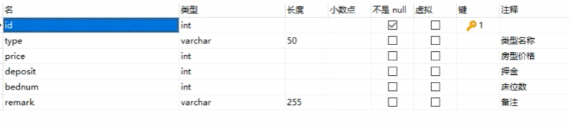

#### b. 项目搭建目录


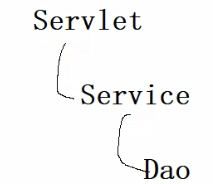

# 二、JSP

> - Java Server Page，运行在服务器端的页面;
> - Java + html 代码；
> - java代码全部都放在<% java 代码 %>中间;
> - tomcat 中的 JSP会转译成Serlet，然后再编译成.class文件去运行；

例如：

```html
<%@ page contentType="text/html;charset=UTF-8" language="java" %>
<html>
<head>
    <title>Title</title>
    <link rel="stylesheet" href="assets/css/bootstrap.min.css">
</head>
<body>
<div class="container">
    <table class="table table-striped table-bordered table-hover">
        <% for (int i = 0; i < 10; i++) %>
    </table>
</div>
</body>
</html>
```

## 1. 请求转发和重定向

> 如何从 Servlet 跳转到 JSP ？方法是”请求转发和重定向“

### （1）请求转发 - 服务器端行为

一个 web 资源收到客户端浏览器请求后，通知服务器去调用另外一个 web 资源来进行处理，服务器端行为

- 工作原理

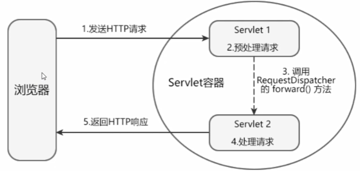

- RequestDispatcher 接口
  - 封装由路径所标识的web资源;
  - getRequestDispatcher 的方法：
    - HttpServletRequest 调用 getRequestDispatcher(String path): 可以是绝对路径，也可以是相对路径;
    - ServletContext 调用 getRequestDispatcher(String path): 是绝对路径；
  - forward(req,resp): 将请求转发给另一个 web 资源;
  - include(req,resp): 将其他 web 资源作为响应内容包含进来;
- 请求转发的特性： ❤️
  - 请求转发不支持跨域访问，只能跳转到当前应用中的资源;
  - 请求转发，浏览器上的 URL 地址不改变，浏览器不知道服务器内部发生了请求转发，也不知道转发的次数;
  - 参与请求转发的 web 资源之间，共享同一个 request 和 response 对象;
  - 可以在请求范围内，使用 setAttribute(名,值),getAttribute(名)，来传递数据;
  - 一次请求，一次响应；

```java
@WebServlet(name = "S2", value = "/S2")
public class S2 extends HttpServlet {
    @Override
    protected void doGet(HttpServletRequest req, HttpServletResponse resp) throws ServletException, IOException {
        req.setCharacterEncoding("GBK");
        resp.setCharacterEncoding("GBK");
        PrintWriter writer = resp.getWriter();
        writer.println("这里是S2的 servlet");
        String k = (String) req.getAttribute("k");
        writer.println(k);

    }
}
```

```java
@WebServlet(name = "S1", value = "/S1")
public class S1 extends HttpServlet {
    @Override
    protected void doGet(HttpServletRequest req, HttpServletResponse resp) throws ServletException, IOException {
        req.setCharacterEncoding("GBK");
        resp.setCharacterEncoding("GBK");
        PrintWriter writer = resp.getWriter();
        writer.println("这里是S1的 servlet");
        // 在请求范围内，放一个名值对
        req.setAttribute("k", "v");
        // 封装转发对象
        RequestDispatcher rd = req.getRequestDispatcher("S2");
        // 调用转发
        rd.forward(req, resp);
//        rd.include(req, resp);
    }
}
```

### （2）重定向 - 客户端行为

当浏览器向服务器发送请求时，通知浏览器重新定向到另一个 web 资源，客户端行为

- 响应码: 200 表示成功，302 表求重定向，404 资源不可访问，500 服务器内部错误(程序错误)
- 工作原理

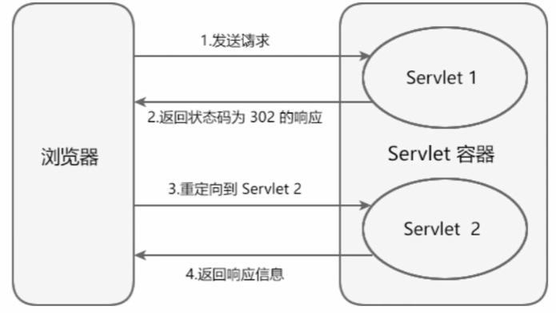

- 调用 resp.sendRedirect(String path);
  ```java
          // 以前的写法
  //        resp.setStatus(302);
  //        resp.setHeader("location", "要跳转的资源地址");
          // 现在的写法
          resp.sendRedirect("要跳转的资源地址");
  ```
- 特性： ❤️
  - 浏览器地址栏会发生变化，变成第二次请求地址；
  - 两次请求和响应，不能再请求范围内传递数据；
  - 可以跨域，可以重定向任何网址；

```java
@WebServlet(name = "S3", value = "/S3")
public class S3 extends HttpServlet {
    @Override
    protected void doGet(HttpServletRequest req, HttpServletResponse resp) throws ServletException, IOException {
        req.setCharacterEncoding("utf-8");
        resp.setCharacterEncoding("utf-8");
        resp.setContentType("text/html");
        PrintWriter writer = resp.getWriter();
        writer.println("这里是S3的 servlet");
        req.setAttribute("K1", "K1");
        // 以前的写法
//        resp.setStatus(302);
//        resp.setHeader("location", "S4");
        // 现在的写法
        resp.sendRedirect("S4");
//        resp.sendRedirect("http://www.baidu.com");
    }
}
```

```java
@WebServlet(name = "S4", value = "/S4")
public class S4 extends HttpServlet {
    @Override
    protected void doGet(HttpServletRequest req, HttpServletResponse resp) throws ServletException, IOException {
        req.setCharacterEncoding("utf-8");
        resp.setCharacterEncoding("utf-8");
        resp.setContentType("text/html");
        PrintWriter writer = resp.getWriter();
        writer.println("这里是S4的 servlet");
        String k1 = req.getAttribute("K1").toString();
        writer.println(k1);
    }
}
```

### （3）总结 ❤️

> 无论是请求转发还是重定向，跳转后，原网页的操作会继续执行，直到结束（可以调用 return; 停止）

- 区别：
  - 请求转发是一次请求，重定向是两次请求；
  - 请求转发浏览器地址不变，重定向浏览器地址改变；
  - 请求转发由于是一次请求，所以效率更高；
  - 请求转发可以在请求范围内传递数据，重定向不可以在请求范围内传递数据；
  - 请求转发不支持跨域，重定向支持跨域；
  - 请求转发是属于服务器端行为，重定向是属于客户端行为；

## 2. JSP 表达式

作用：

> 将动态信息显示在页面上，以字符串方式，返回给浏览器端

语法格式：

> <%=变量或者表达式%>，注意：不能使用分号放在后面；

# 三、会话跟踪技术

> - 会话：在 web 应用中，浏览器和服务器在一段时间内发送请求和响应的连续交互的全过程叫做一次会话；
> - 会话跟踪：对同一个用户跟服务器的连续请求和接收响应的监视过程；
>   - 作用：浏览器和服务器是以http协议进行通信，http协议是无状态协议，本身是不会跟踪用户状态的。在类似于购物网站、电子邮箱，多次请求的操作，无法判断是否是同一个用户在执行，因此，需要使用会话跟踪技术。

## 1.四种会话跟踪技术 ❤️

### （1）Cookie

客户端浏览器

> Cookie 是指使用 Cookie 对象实现跟踪用户会话的技术，在客户端浏览器保持会话跟踪的解决方式

- Cookie 以键值对形式保存信息，存储在客户端浏览器；
- 当用户第一次向服务器发送请求时，服务器会将 Cookie 的信息随着响应（请求头）发送给客户端浏览器；
- 客户端浏览器会将信息保存起来，下一次发送请求时，会携带 Cookie 中的信息，作为用户的唯一标识，被服务器跟踪识别；
- Cookie 会限制不超过4KB，并且不能跨浏览器使用； 👀️

> 用途：跟踪用户状态，保存一些业务信息，记录用户登录状态；
>
> 生命周期：Cookie 默认生命周期是浏览器关闭；

案例代码：

```java
Cookie namecookie=new cookie("namecookie",admin.getName());
Cookie pwdcookie=new cookie("pwdcookie",pwd);
//设置cookie存活时间
namecookie.setMaxAge(60*60*24*10);
pwdcookie.setMaxAge(60*60*24*10);
//将cookie放在响应中，通过响应返回到浏览器端r
response.addcookie(namecookie);
response.addcookie(pwdcookie);
```

```java
// 查看 Cookie
Cookie[] cookies=request.getcookies();
if(cookies!=null)
    for(Cookie cookie : cookies){
         System.out.printin(cookie.getName()+"\t"+cookie.getValue());
    }
```

### （2）Session

服务器端

> Session 是指使用 HttpSession 对象，实现会话跟踪技术,是一种在服务器端保持会话跟踪的方案。

⭐️ 本质也是采用客户端会话管理技术，要依赖 Cookie 技术，在客户端保存一个特殊标识，共享的数据保存在服务器端的内存中。

- HttpSession 是由 JavaWeb API提供的接口，用来做会话跟踪的，保存在服务器端；
- 当用户第一次访问服务器(Servlet或jsp动态资源时)，创建 HttpSession 对象，为对象分配一个唯一的 SessionID，将 SessionId 作为Cookie (url重写) 发送到浏览器端，浏览器会保存这个 Cookie 的数据；
- 当浏览器端再次发送请求时，Cookie会一起发送过来，服务器端获取 SessionID，根据 SessionID 找到对应的 HttpSession 对象，跟踪客户端的状态；

> session失效情况：🚀️
>
> 1. 关闭浏览器
> 2. 将工程从服务器退出
> 3. 超过最大不活动时间, 默认最大不活动时间 1800秒(30分钟)
> 4. 调用方法，让当前 session 失效

session 获取：

```java
// 以下两行代码功能相同，获取session，如果没有，就创建一个新的，如果有，则直接返回这个session
Httpsession session=req.getSession();
Httpsession session=req.getSession(true);
// 获取 session，如果有，则直接返回这个 session，如果没有，则返回 null
Httpsession session=req.getSession(false);
```

获取 sessionId：

```java
session.getId(); //获取sessionId
session.isNew(); //判断session是否是新的
```

session 失效的情况：

```java
// session失效
// 1. 关闭浏览器
// 2. 将工程从服务器退出
// 3. 超过最大不活动时间 默认最大不活动时间 1800秒(30分钟)
// 4. 调用方法，让当前session失效
// 让当前session失效
session.invalidate();
```

设置 session 对象最大不活动时间：

```java
//设置session最大不活动时间，以秒钟为单位
session.setMaxInactiveInterval(5);
//获取session最大不活动时间
session.getMaxInactiveInterval();
```

session 属性数据：

```java
session.setAttribute("名","值(object)");
session.getAttribute("名");
session.removeAttribute("名"); //移除属性数据
```

### （3）URL 重写处理 👀️

> 也是会话跟踪的一种技术，主要用于浏览器端阻止所有的 cookie，不能在浏览器端去保存 session 的 id，没有办法跟踪用户。

可以将 jsessionid 缀到 url 地址后面，每次访问服务器，都会带着这个 sessionid 的数据:

```java
response.encodeUrl("要重写的ur1地址")
```

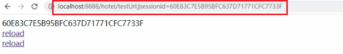

### （4）隐藏表单域技术

隐藏表单可以将 sessionid 从url中隐藏，但是查看网页源代码时仍然可以看到：

```html
<form>
<input type="hidden" name="jsessionid'Value="ABEC7EFE03A26EC012DD83A8BD685F1C"><input type="submit" value="提交">
</form>
```

是使用 html 中的 input type="hidden" 控件，在网页表单中隐藏相关客户端信息，在提交表单时，将信息一并发送给服务器端，服务器通过读取 jsessionid，去跟踪用户状态。

# 四、过滤器

## 1. 配置欢迎页

web.xml(部署描述符文件)文件中进行修改，可以有多个，按由上到下顺序去执行，先找到哪个页面就将哪个页面当成欢迎页面显示；

```xml
<welcome-file-list>
    <welcome-file>login_ajax.jsp</welcome-file>
    <welcome-file>login.jsp</welcome-file>
    <welcome-file>index.jsp</welcome-file>
</welcome-file-list>
```

## 2. 过滤器 ❤️

> 属于web应用的组件，具有拦截客户端浏览器请求的功能，针对这些请求数据做处理，拦截服务器端的响应数据，做处理。

- 过滤器可以有多个，形成一行过滤链;
- 过滤器使用场景：权限管理、编码、日志、性能监控

使用：

- 要求必须实现 javax.servlet.Filter 接口，重写 doFilter() 方法；
- 配置

  - xml配置：

    ```xml
    <filter>
        <filter-name>encoding</filter-name>
        <filter-class>com.coder.util.EncodingFilter</filter-class>
    </filter>
    <filter-mapping>
        <filter-name>encoding</filter-name>
        <url-pattern>/*</url-pattern>
    </filter-mapping>
    ```
  - 或注解配置

    ```java
    @WebFilter("/*")
    public class EncodingFilter implements Filter {
    ```
  - 初始化配置：

    ```java
    @WebFilter(value ="/*", initParams ={@WebInitParam(name = "encode",value = "gbk")})
    public class EncodingFilter implements Filter {
    ```
- 使用：编码过滤器

  ```java
  @WebFilter(value = "/*",
          initParams = {@WebInitParam(name = "encode",value = "utf-8")})
  public class EncodingFilter implements Filter {
      private String encode;
      @Override
      public void init(FilterConfig filterConfig) throws ServletException {
          encode = filterConfig.getInitParameter("encode");
      }

      @Override
      public void doFilter(ServletRequest servletRequest,
                           ServletResponse servletResponse,
                           FilterChain filterChain) throws IOException, ServletException {
          servletRequest.setCharacterEncoding(encode);
          servletResponse.setCharacterEncoding(encode);
          //表示当前过滤节点结束，向下一个节点跳转
          filterChain.doFilter(servletRequest,servletResponse);
          //System.out.println("run encoding filter");
      }
  }
  ```

# 五、EL 表达式和 JSTL

## 1. EL 表达式

- EL 表达式，Expression Language，表达式语言；
- 主要作用，在 jsp 页面上获取数据，擅长查找对象，配合 JSTL，使JSP页面摆脱大量的Java代码片；
- 语法格式 ${表达式内容}

### （1）使用

EL表达式，作用域范围：


> 如果不写作用范围，会由小到大进行查找，找到就返回，找不到就不显示
>
> 没有空指针异常，没有数组下标越界问题

jsp 注释：

```jsp
<!--注释 查看源代码会显示-->
<%--注释 查看源代码也不显示--%>
```

### （2）运算符

```html
    ${"1"=="1"}  ${"1" eq "2"}
    ${1!=2}  ${1 ne 2}
    ${1<2}  ${1 lt 2}
    ${1<=2}  ${1 le 2}
    ${1>2}  ${1 gt 2}
    ${1>=2}  ${1 ge 2}
    ${5>3 && 3>2}  ${5>3 and 3>2}
    ${5>3 || 3>2}  ${5>3 or 3>2}
    ${!5>3}   ${not 5>3}
    empty 判断对象是否为null，判断字符串是否是空串或者 null 值，判断集合是否为空 ${empty list}
```

### （3）隐式对象

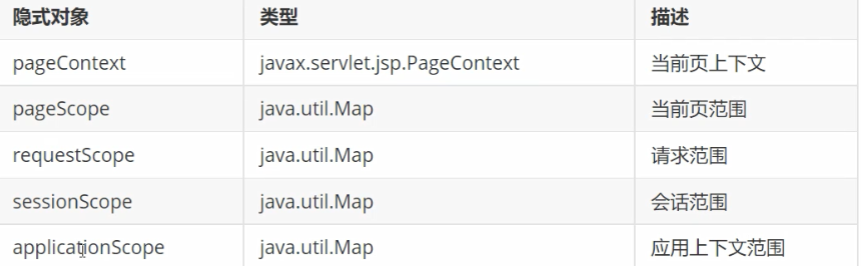

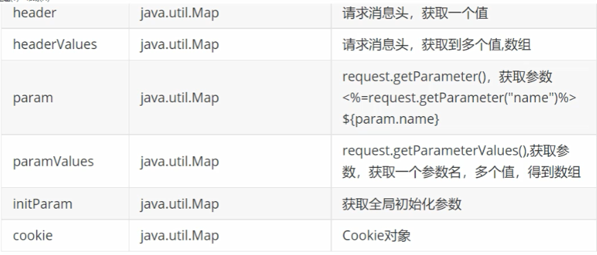

## 2. JSTL

> JavaServerPages Standard Tag Library （JSP标准标签库)

JSTL 提供了五大类标签库

1. 核心标签库 prefix="c"
2. 国际化(i18n)标签库 prefix="fmt"
3. sql标签库 prefix="sql"
4. xml标签库 prefix="xml"
5. 函数标签库 prefix="fn"

### （1）核心标签库

步骤1: 需要jar包: jstl standard

步骤2: 在jsp上，使用taglib指令，导入jstl

> <%@ taglib prefix="c" uri="http://java.sun.com/jsp/jst1/core"%>

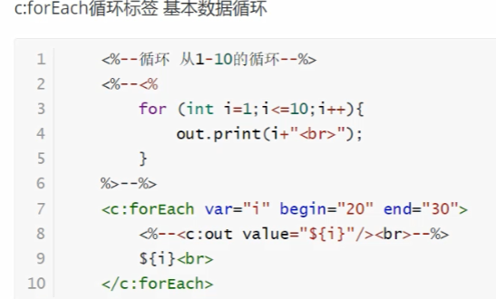

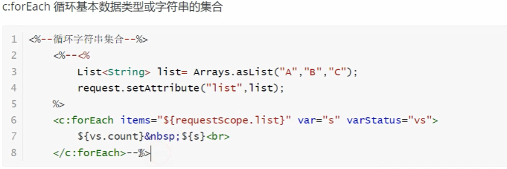


> 属性的说明：
>
> items: 集合，用el表达式处理
> var: 每次循环取出的临时变量名
> varStatus: 循环状态
> index: 索引，从0开始
> count: 统计循环次数，从1开始
> first: boolean 判断是否是第一个元素
> last: boolean 判断是否是最后一个元素
> begin: 循环的初值
> end: 循环的终值
> step: 步长，循环间的数值

# 六、文件上传与下载

## 1. 文件上传

- 表单
- 必须使用 post 提交，enctype 必须是 mutipart / form-data

```html
<form action="RoomInfoservlet?flag=save" method="post" enctype="multipart/form-data">
```

- 在Servlet上添加注解 `@Multipartconfig；可以在注解上配置上传路径或者文件上传大小限制；或者在代码中手动处理也可以
- 执行上传处理

  ```java
       //获取当前工程真实路径
          ServletContext context = this.getServletContext();
          String realPath = context.getRealPath("/");
          String path = realPath + "upload";
          File dir = new File(path);
          dir.mkdirs();//创建目录
          //完成上传处理
          Part part = request.getPart("pic");
          String fileName = part.getSubmittedFileName();
          String extName = fileName.substring(fileName.lastIndexOf("."));
          String prefix = String.valueOf(System.currentTimeMillis());
          fileName = prefix + extName;
          File file = new File(dir, fileName);
          //上传处理
          part.write(file.getAbsolutePath());
          //UUID.randomUUID().toString().replace("-","");
          info.setPic("/upload/" + fileName);
          service.insert(info);
  ```

### （1）ServletConfig 配置对象

- ServletConfig 是 Servlet 配置参数对象；
- 在 Servlet 的规范中，每一个 Servlet 都可以提供一些初始化参数配置，每个 Servlet 都有一个自己的 ServletConfig 对象；
- 主要作用是读取 Servlet 初始化参数处理；

#### a. XML 中配置 Servlet 初始化参数

```xml
<servlet>
        <servlet-name>roomInfo</servlet-name>
        <servlet-class>com.coder.servlet.RoomInfoServlet</servlet-class>
        <init-param>
            <param-name>status</param-name>
            <param-value>1:空,2:有客,3:空脏,4:备用</param-value>
        </init-param>
        可以配置多个
         <init-param>
            <param-name>status</param-name>
            <param-value>1:空,2:有客,3:空脏,4:备用</param-value>
        </init-param>
    </servlet>
    <servlet-mapping>
        <servlet-name>roomInfo</servlet-name>
        <url-pattern>/RoomInfoServlet</url-pattern>
    </servlet-mapping>
```

#### b. 注解配置 Servlet 初始化参数

```java
@WebServlet(name = "RoomInfoServlet",value = "/RoomInfoServlet", initParams = {
        @WebInitParam(name = "status", value = "1:空,2:有客,3:空脏"),
        @WebInitParam(name="email",value = "126.com")})
```

#### c. ServletConfig API

- 常见方法

```java
        ServletConfig config = this.getServletConfig();
        //1:空,2:有客,3:空脏,4:备用
        //获取初始化参数
        String status = config.getInitParameter("status");
        //获取Servlet名字
        String servletName = config.getServletName();
        Enumeration<String> initParameterNames = config.getInitParameterNames();
        //对枚举类型进行循环
        while (initParameterNames.hasMoreElements()) {
            System.out.println(initParameterNames.nextElement());
        }
        // 获取 ServletContext 对象
        ServletContext context=config.getServletContext();
```

### （2）ServletContext 对象

Servlet 应用上下文对象，针对当前工程，所有的Servlet，只有一个 ServletContext 对象；（最大范围）

> 生命周期: 应用加载开始创建，应用停止时销毁；

- 获取方式

```java
        //要在ServletContext作用域范围内设置一个名值对
        //获取ServletContext方式
        ServletContext context;
        context=req.getServletContext();
        context=session.getServletContext();
        context=this.getServletConfig().getServletContext();
        context=this.getServletContext();
```

- 在 ServletContext 范围内赋值

```java
//赋值
context.setAttribute("c","context");
//取值
context.getAttribute("c");
//移除
context.removeAttribute('c");
```

- 配置 ServletContext 初始化参数

> web.xml，独立于所有的 servlet，单独配置

```xml
    <context-param>
        <param-name>email</param-name>
        <param-value>123@126.com</param-value>
    </context-param>
```

获取参数

```java
String email = getservletcontext().getInitParameter("emai");
```

其他方法：

```java
        // 获取所有初始化参数
        Enumeration<String> initParameterNames = context.getInitParameterNames();
        // 获取真实路径
        context.getRealPath("/");
        // 获取服务器信息
        String serverInfo = context.getServerInfo();
        System.out.println("服务器:"+serverInfo);
        // 获取servlet主版本号和次版本号
        int majorVersion = context.getMajorVersion();
        int minorVersion = context.getMinorVersion();
        System.out.println("minorVersion = " + minorVersion);
        System.out.println("majorVersion = " + majorVersion);
        //获取当前工程虚拟上下文路径
        String contextPath = context.getContextPath();
        System.out.printin(contextPath);
```

### （3）监听器

- 用来监听 Servlet 组件对象状态发生变化的组件了；
- 可以监听的源包括: ServletRequest、HttpSession、ServletContext；
- 当监听到事件源状态发生变化时，会有对应的响应行为；

在 web.xml 文件中配置监听

```xml
    <listener>
        <listener-class>com.coder.util.ListenerContext</listener-class>
    </listener>
```

通过注解配置，在监听器上加注解：

`@WebListener`

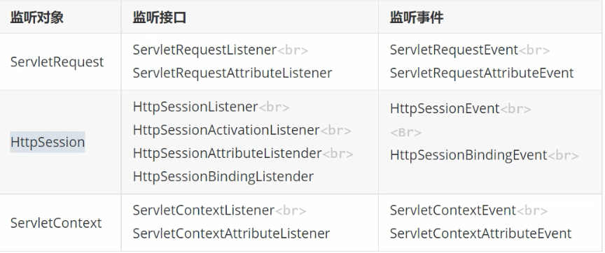

实际上，当浏览器关闭之后，Cookie失效了不能再通过cookie中记录的jsessionid去跟踪到当前用户，所以无法通过cookie去访问session了，但是session对象并没有马上被回收。

```java
@WebListener
public class ListenerContext implements
        ServletContextListener, ServletContextAttributeListener,
        ServletRequestListener,ServletRequestAttributeListener {
    @Override
    public void attributeAdded(ServletContextAttributeEvent scae) {
        //System.out.println("增加了ServletContext属性");
        //System.out.println(scae.getName());
    }

    @Override
    public void attributeReplaced(ServletContextAttributeEvent scae) {
        //System.out.println("替换了ServletContext属性");
    }

    @Override
    public void attributeRemoved(ServletContextAttributeEvent scae) {
        //System.out.println("移除了ServletContext属性");

    }

    @Override
    public void contextInitialized(ServletContextEvent sce) {
        //System.out.println("项目启动...");
       /* Timer timer=new Timer();
        timer.schedule(new TimerTask() {
            @Override
            public void run() {
                System.out.println(DateTimeFormatter.ofPattern("yyyy-MM-dd HH:mm:ss").
                        format(LocalDateTime.now()));
            }
        },0,2000);*/
    }
}
```

## 2. 文件下载

### （1）请求头

用于说明是谁在发送请求，请求来源，或者客户端浏览器型号及能力，服务器可以根据请求头能给出客户端信息。

这些数据，在浏览器中看不到(除非是通过调试工具可以看到)，需要通过程序去进行读取。

```java
@WebServlet("/HeadServlet")
public class HeadServlet extends HttpServlet {
    @Override
    protected void service(HttpServletRequest req, HttpServletResponse resp) throws ServletException, IOException {
        resp.setContentType("text/html");
        PrintWriter out=resp.getWriter();
        //获取所有请求头的名字，得到一个枚举类型
        Enumeration<String> headerNames = req.getHeaderNames();
        while (headerNames.hasMoreElements()) {
            //获取请求头名字
            String name=headerNames.nextElement();
            //通过请求头名字，获取值
            out.println(name+":"+req.getHeader(name)+"<br>");
        }
    }
}
```

```yaml
host:localhost:8080
connection:keep-alive
cache-control:max-age=0
sec-ch-ua:"Not)A;Brand";v="99", "Google Chrome";v="127", "Chromium";v="127"
sec-ch-ua-mobile:?0
sec-ch-ua-platform:"Windows"
upgrade-insecure-requests:1
user-agent:Mozilla/5.0 (Windows NT 10.0; Win64; x64) AppleWebKit/537.36 (KHTML, like Gecko) Chrome/127.0.0.0 Safari/537.36
accept:text/html,application/xhtml+xml,application/xml;q=0.9,image/avif,image/webp,image/apng,*/*;q=0.8,application/signed-exchange;v=b3;q=0.7
sec-fetch-site:none
sec-fetch-mode:navigate
sec-fetch-user:?1
sec-fetch-dest:document
accept-encoding:gzip, deflate, br, zstd
accept-language:zh-CN,zh;q=0.9
cookie:JSESSIONID=C0F34D0D51632A4387E71982B9720751; Idea-daea4706=b8349a76-ebb4-4467-8ba4-4f0101cdad40
```

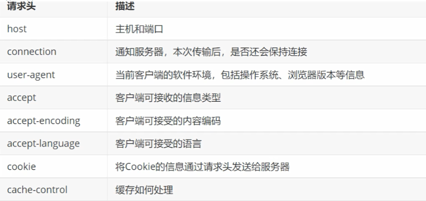

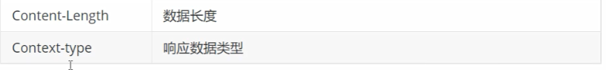

### （2）文件下载

```java
    public void download(HttpServletRequest request,HttpServletResponse response) throws IOException {
        String path=request.getParameter("path");
        String fileName=path.substring(path.lastIndexOf("/")+1);
        String realPath=this.getServletContext().getRealPath("/");
        String file=realPath+path;
        //设置一下响应相关的类型
        response.setContentType("application/octet-stream");
        response.setHeader("Content-Disposition","attachment;filename=\""+fileName+"\"");
        //通过IO流，实现文件下载
        FileInputStream fis=new FileInputStream(file);
        OutputStream os= response.getOutputStream();
        byte[] buffer=new byte[1024];
        int b=-1;
        while ((b=fis.read(buffer))!=-1){
            os.write(buffer,0,b);
        }
        fis.close();
        os.close();
    }
```

### （3）JSP 内置对象

> jsp隐藏对象、内建对象，或者内置对象; 在jsp中，不需要声明，可以直接使用的对象； 9 类

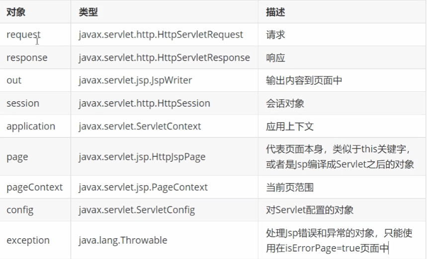

> 当一个jsp通过page指令 isErrorPage=true，表明，这个jsp是专门处理异常的jsp;
>
> 当一个jsp通过page指令 errorPage="指定页"，表明，当前页面出现错误后跳转到指定页;

```jsp
<%@ page contentType="text/html;charset=UTF-8" language="java" %>
<html>
<head>
    <title>Title</title>
</head>
<body>
  <%
    int i=10/0;
  %>
</body>
</html>
```

```jsp
<%@ page contentType="text/html;charset=UTF-8" language="java"
         isErrorPage="true" %>
<html>
<head>
    <title>Title</title>
</head>
<body>
    异常:<%=exception%>
</body>
</html>
```

### （4）响应状态码

> 200: 表示处理成功
> 404: 表示访问资源丢失(浏览器端返回的问题)
> 500: 服务器内部错误

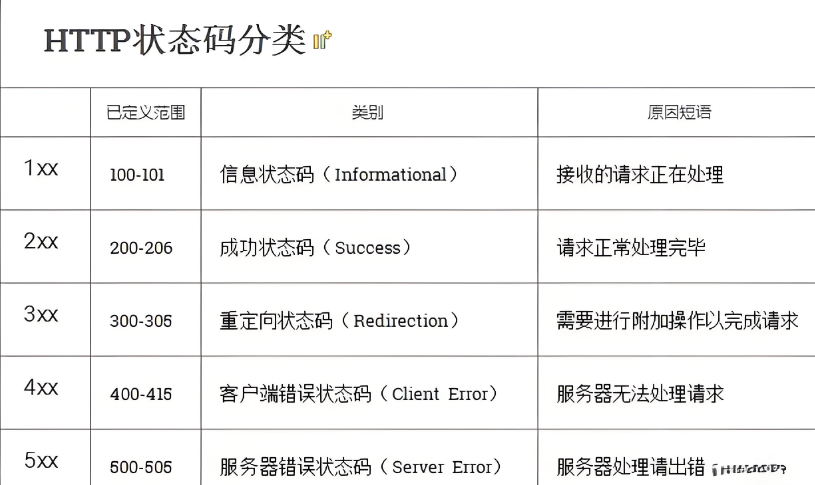

### （5）JSP 指令

jsp 三种指令：

> - <%@ page%>: 定义相关的信息
> - <%@ taglib %>: 用来导入jstl
> - <%@ include%>: 将其他页面包含到当前页面中，最后编译成一个 servlet
>   - 为了实现整站页面的统一风格

### （6）JSP 动作

```jsp
<jsp:动作名 属性="属性值"></jsp:动作名>
```

```jsp
<jsp:include> 包含
<jsp:forward>: 跳转相当于request.getRequestDispatcher().forward()
<jsp:param>: 和jstl相同，用来传递参数
<jsp:useBean> javaBean:java可重用的组件
```

```jsp
<jsp :forward page="forward2.jsp">
    <jsp:param name="email" value="aaa@126.com"/>
</jsp:forward>
```

# 七、MVC 模式 ❤️ 

> - Model1: jsp + javaBean
> - Model2: Servlet + JSP + JavaBean (MVC)

1. Model （模型）
2. View （视图）
3. Controller (控制器)

> 一种软件架构模式，做分层处理。将软件界面、业务逻辑分离，使代码具有更高的可扩展、可复用性，易于维护，降低耦合性。

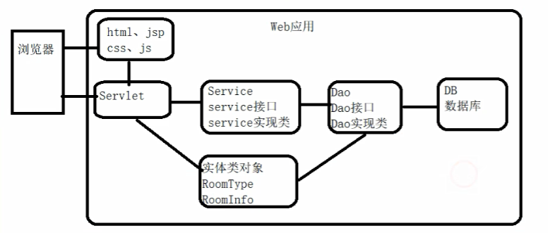


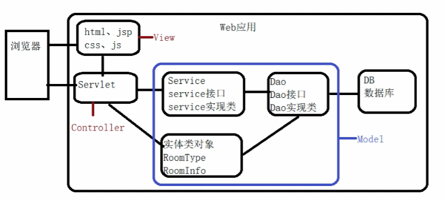

工作流程：

1. 用户发送请求到服务器;
2. 服务器通过 Controller 层，接收请求;
3. 调用相关的 Model 层处理请求，并访问数据库;
4. Model 层处理完成后，将结果返回给 Controller层;
5. Controller 根据 Model 返回的结果，跳转到相应的 View 层;
6. View 层渲染最终的效果响应给浏览器;

优点：

1. 降低代码耦合性；
2. 利于分工合作；例如：前台美工，负责处理界面，DBA负责处理数据
3. 利于组件复用；

# 八、web.xml 配置

- 配置初始化参数配置Servlet
- 配置过滤器
- 配置监听器 （如：用于统计在线人数）
- 配置 ServletContext 初始化参数
- 配置欢迎页
- 配置错误页

  ```xml
  <error-page>
      <error-code>404</error-code>
      <1ocation>/404.jsp</1ocation>
  </error-page>
  <error-page>
      <error-code>500</error-code>
      <location>/500.jsp</1ocation>
  </error-page>
  ```
- 配置 Session 失效时间

  ```xml
  # 20 分钟失效
  <session-config>
      <session-timeout>20</session-timeout>
  </session-config>
  ```

> 如果，同时在程序中和配置文件中，都设置了最大不活动时间，则以程序设置为主

# 九、Tomcat 项目部署

## 1. 直接复制

直接复制，将文件复制到 tomcat 服务器目录 webapps 下

在：项目路径下/out/artifacts/项目名称_war_exploded/*

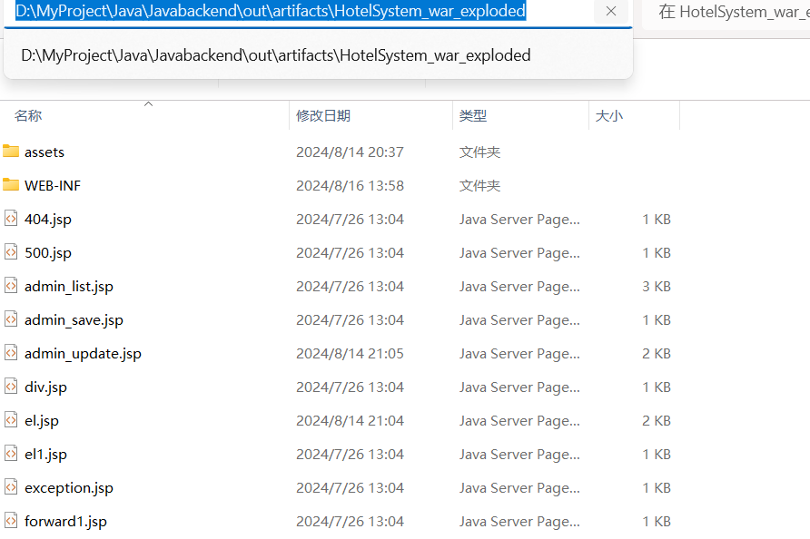

> 其中包括编译好的java代码.class文件 ❤️

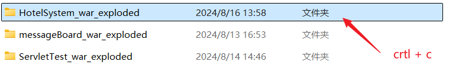

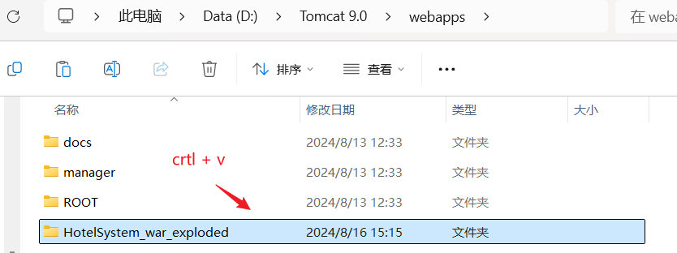

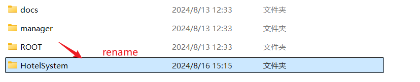

> 访问路径：ip:端口/HotelSystem/资源路径...
>
> 如：localhost:8888/HotelSystem/RoominfoServiet?flag=selectList

## 2. 在 \Tomcat 9.0\conf\Catalina\localhost 目录下，创建.xml文件

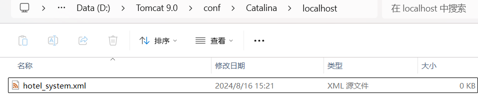

写入：

```xml
<Context path="hotel_system"
docBase="D:\MyProject\Java\Javabackend\out\artifacts\HotelSystem_war_exploded"/>
```

> 给出编译好的项目绝对路径

访问路径：localhost:8888/hotel_system/RoominfoServiet?flag=selectList


0000000
