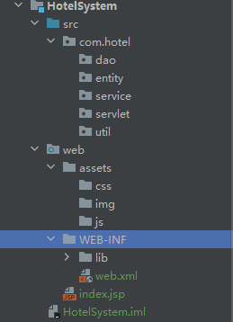

# Javabackend

JavaWeb 后端开发技术，也就是学习 JavaEE (Enterprise Edition) 版本；是一种结构和一套标准。在应用中开发的标准就是我们接下来要学习的 Servlet、jsp 和 JavaBean技术。web后端开发，基于B/S模式的开发体系。

> jsp技术现在已基本处于淘汰状态，只做简单介绍，不做系统讲述 👀️


# 一、SeverLet

> server + let
>
> - servlet 基于java技术的web组件，使用java编写的服务器端程序;
> - 实现了 ServletAPI 规范的 java 应用程序就是 Servlet;
> - 主要是用来处理来自web浏览器或者其他http客户端的请求，动态的生成内容给到客户端进行响应;
> - servlet 和大多数的 java 组件一样，是和平台无关性的组件;
> - 可以被编译成机器字节码被基于 java 技术的 web 服务器加载和运行;

要部署和运行 servlet，需要使用 web容器(服务器)，web容器本质上就是与 servlet 交互的 web 服务器组件，负责管理 servlet 生命周期，将 URL 映射到特定的 servlet，并确保 URL 请求者具有正确的权限。

> - 以浏览器作为展示客户端界面的窗口客户端界面表现为网页形式;
> - 一般由html语言、jsp、vue等前端框架写成;
> - 客户端和服务器可以进行业务相关的动态交互;
> - 可以完成类似于桌面应用程序的功能;
> - 使用浏览器/服务器架构(Browser/Server)，采用 http 协议进行通信;
> - web应用通过web服务器来发布;

## 1. Tomcat 服务器

> - tomcat 是在 oracle 公司的 JSWDK(avaServer Web DelevopmentKit)的基础上发展起来的一个优秀的开源的 servlet 容器;
> - tomcat 使用 java 语言编写。运行稳定、可靠、效率高，可以和目前 主流web服务器一起工作(如IIS、Apache、Nginx);
> - tomcat 是 Apache 软件基金会(Apache Software Foundation)的Jakarta项目中一个核心项目;
> - 属于轻量级应用服务器，在中小型系统和并发访问用户量不是很多的场合下应用;

### （1）下载和安装

> 官网: https://tomcat.apache.org/
> 下载地址: https://tomcat.apache.org/download-90.cgi

安装后访问：http://localhost:8080/，即安装成功

### （2）Tomcat 目录结构

目录：

- bin 目录: 主要存储 tomcat 的相关指令，存放.bat文件(windows批处理文件) / .sh ;
- conf 目录: 主要用来存放 tomcat 的配置文件;
- lib 目录: 所有部署在 tomcat 中的 web 应用公用的 jar 包;
- logs 目录: 保存 tomcat 日志数据;
- temp 目录: 存放 tomcat 运行期间产生的临时文件;
- webapps 目录: tomcat 默认的项目部署目录，可以放未打包的目录，也可以存放打成 war 包的目录 :star:
- work 目录: 用来存放 jsp 转译成 java，再进行编译后的 class 文件;

文件：

- LICENSE: tomcat 开源许可文件；
- NOTICE: tomcat 说明文件；
- RELEASE-NOTES: 版本说明文件；

### （3）Tomcat 启动和停止

启动三种方式：

- 运行 startup.bat 文件
- 运行 tomcat9.exe 文件
- 运行 tomcat9w.exe 文件 （带用户界面的程序）

停止：

- 关闭窗体
- ctrl + c
- 运行 shutdown.bat 文件

> tomcat 启动乱码问题解决:
>
> \Tomcat 9.0\conf\logging.properties，修改日志输出配置
>
> 
>
> 

### （4）Tomcat 用户配置

\Tomcat 9.0\conf\tomcat-users.xml 文件配置

```html
<role rolename="manager"/>
<role rolename="manager-gui"/>
<role rolename="admin"/>
<role rolename="admin-gui"/>
<user username="tomcat" password="tomcat" roles="manager, manager-gui, admin, admin-gui"/>
```

访问 http://localhost:8080


### （5）IDEA 集成 Tomcat 配置

1. 添加配置


2. 启动与停止


## 2. 留言板（入门）

### （1）IDEA 下创建 Web 工程

1. 创建一个 java 模块；
2. 右键该模块下拉，添加 web 支持；

   
3. 添加 web 应用程序


4. 在 WEB-INF 文件夹下 创建 lib 目录：用于存放当前工程所使用主要 jar 包

> - src: 存放 servlet 程序；
> - web：存放 css/html/jsp 图片等；


5. 配置 lib 为 jar 目录


> 因此，后续添加到 lib 的 jar包，都会被自动识别

6. 配置文件编码 为 UTF-8；
7. 配置 Tomcat; (如前所述) 🔴
8. 将 Tomcat 库加入项目依赖中；

   

> 这会把当前 tamcat 所用到的 jar 包都导入到当前项目中来；


10. 创建 servlet 测试 （留言板前端） ⭐️

> web 目录下创建 message.html 文件

```html
<!DOCTYPE html>
<html lang="en">
<head>
    <meta charset="UTF-8">
    <title>Title</title>
</head>
<body>
<form action="" method="post">
    <div>
        昵称：
        <input type="text" name="nickName">
    </div>
    <div>
        留言：
        <textarea name="content"></textarea>
    </div>
    <div>
        <button type="submit">提交留言</button>
    </div>
</form>
</body>
</html>
```

12. 添加工件


> 启动后默认访问 index.jsp, 访问 http://localhost:8080/message/message.html 可以访问到 message.html
>
> 

### （2）留言板（后端）

1. 创建 servlet 程序


2. 前后端对应


#### a. 请求与响应

> - 请求：HttpServletRequest request
> - 响应：HttpServletResponse response
>
> 主要用于前后端之间的数据传递

```java
        // 设置响应内容类型是网页
        response.setContentType("text/html");
        // 设置响应编码
        response.setCharacterEncoding("utf-8");
        // 获取打印流
        PrintWriter out = response.getWriter();
        out.println("您的昵称是：" + nickName + "<br>"); // br实现换行
        out.println("您的留言是：" + content);
```

#### b. 留言板保存功能

#### c. 留言板查看功能

如果是直接在 URL 地址上访问一个 Servlet 路径，调用 doGet 方法，如果是通过超链接，访问的 Servlet 路径，也是调用 doGet 方法；

> ❤️ xxxServlet 类用于处理业务逻辑
>
> 1. 创建类，命名规则：`xxxServlet`；
> 2. 继承 `HttpServlet` 类，并重写 `doPost`&`doGet` 方法；
> 3. 使用类注解，定义名称和路径 `@WebServlet(name = "ViewMessageBoardServlet", value = "/view")`

## 3. Servlet API


> 继承 HttpServlet 类，通常只需要重写 doGet() 和 doPost()方法

- HttpServlet 继承 GenericServlet；
- GenericServlet 实现了 Servlet 接口，ServletConfig 接口, Serializable 接口；
- 自定义 Servlet 继承 HttpServlet；

### （1）Servlet 生命周期

> Servlet 接口，有三个方法关乎 Servlet 的生命周期（从上到下是调用顺序）
>
> - 构造方法
> - init
> - service
> - destroy


生命周期： ❤️

- 第一步：容器加载 Servlet；
- 第二步: 调用 Servlet 的无参构造方法，实例化；
- 第三步: 调用 init() 方法，完成初始化操作 (在servlet生命周期中，只执行一次)；
- 第四步: 调用 service() 方法，处理浏览端发送的请求，(HttpServlet中，可以调用 doGet 或 doPost)；
- 第五步: 调用 destroy() 方法，销毁线程；

### （2）Servlet 执行过程

> Servet 放在容器中(Tomcat)执行的，用户编写好程序后，部署在容器中，就可以了


1. 浏览器向服务器发送请求，带着访问的 url 地址(即访问哪一个Servlet，即相应的路径);
2. 服务器处理部分接收，根据 url 找到对应的 Servet，产生两个对象: 请求和响应;
3. 创建一个线程，由访线程去访问对应的 Servlet;
4. 调用 Servlet 中的 doGet 或者是 doPost 方法，去完成用户的请求;
5. 将处理结果返回给服务器;
6. 服务器将响应返回给浏览器端;
7. 线程被销毁或放在线程池中;

### （3）Servlet 是线程非安全的

> Servlet 在默认情况下是线程不安全的。这是因为 Servlet 容器（如Tomcat）为了提高性能，通常会对 Servlet 实例进行重用，并采用多线程的方式处理并发的 HTTP 请求。这意味着同一个 Servlet 实例的方法可能会被多个线程同时调用。 ❤️
>
> - 默认每个 Servlet 只创建一个实例；
> - 多线程处理用户 Http 请求；
> - 同一个 Servlet 实例的方法可能会被多个线程同时调用；

## 4. Http 协议

- Http 是基于 TCP/IP 协议之上的应用层协议；
- 使用 请求-响应 模式；
- 请求从客户端浏览器发出，由服务器端响应该请求，并返回给浏览器端；
- 无状态: 自身不对请求和响应之间的通信状态进行保存；
- 无连接: 限制每次连接只处理一个请求，服务器处理完浏览器的请求，并收到浏览器应答后，就断开连接；

## 5. 酒店管理系统（案例）

### （1）酒店房间类型

#### a. 数据库表结构


#### b. 项目搭建目录




# 二、JSP

> - Java Server Page，运行在服务器端的页面;
> - Java + html 代码；
> - java代码全部都放在<% java 代码 %>中间;

例如：

```html
<%@ page contentType="text/html;charset=UTF-8" language="java" %>
<html>
<head>
    <title>Title</title>
    <link rel="stylesheet" href="assets/css/bootstrap.min.css">
</head>
<body>
<div class="container">
    <table class="table table-striped table-bordered table-hover">
        <% for (int i = 0; i < 10; i++) %>
    </table>
</div>
</body>
</html>
```

## 1. 请求转发和重定向

> 如何从 Servlet 跳转到 JSP ？方法是”请求转发和重定向“

### （1）请求转发 - 服务器端行为

一个 web 资源收到客户端浏览器请求后，通知服务器去调用另外一个 web 资源来进行处理，服务器端行为

- 工作原理


- RequestDispatcher 接口
  - 封装由路径所标识的web资源;
  - getRequestDispatcher 的方法：
    - HttpServletRequest 调用 getRequestDispatcher(String path): 可以是绝对路径，也可以是相对路径;
    - ServletContext 调用 getRequestDispatcher(String path): 是绝对路径；
  - forward(req,resp): 将请求转发给另一个 web 资源;
  - include(req,resp): 将其他 web 资源作为响应内容包含进来;
- 请求转发的特性： ❤️
  - 请求转发不支持跨域访问，只能跳转到当前应用中的资源;
  - 请求转发，浏览器上的 URL 地址不改变，浏览器不知道服务器内部发生了请求转发，也不知道转发的次数;
  - 参与请求转发的 web 资源之间，共享同一个 request 和 response 对象;
  - 可以在请求范围内，使用 setAttribute(名,值),getAttribute(名)，来传递数据;
  - 一次请求，一次响应；

```java
@WebServlet(name = "S2", value = "/S2")
public class S2 extends HttpServlet {
    @Override
    protected void doGet(HttpServletRequest req, HttpServletResponse resp) throws ServletException, IOException {
        req.setCharacterEncoding("GBK");
        resp.setCharacterEncoding("GBK");
        PrintWriter writer = resp.getWriter();
        writer.println("这里是S2的 servlet");
        String k = (String) req.getAttribute("k");
        writer.println(k);

    }
}
```

```java
@WebServlet(name = "S1", value = "/S1")
public class S1 extends HttpServlet {
    @Override
    protected void doGet(HttpServletRequest req, HttpServletResponse resp) throws ServletException, IOException {
        req.setCharacterEncoding("GBK");
        resp.setCharacterEncoding("GBK");
        PrintWriter writer = resp.getWriter();
        writer.println("这里是S1的 servlet");
        // 在请求范围内，放一个名值对
        req.setAttribute("k", "v");
        // 封装转发对象
        RequestDispatcher rd = req.getRequestDispatcher("S2");
        // 调用转发
        rd.forward(req, resp);
//        rd.include(req, resp);
    }
}
```

### （2）重定向 - 客户端行为

当浏览器向服务器发送请求时，通知浏览器重新定向到另一个 web 资源，客户端行为

- 响应码: 200 表示成功，302 表求重定向，404 资源不可访问，500 服务器内部错误(程序错误)
- 工作原理


- 调用 resp.sendRedirect(String path);
  ```java
          // 以前的写法
  //        resp.setStatus(302);
  //        resp.setHeader("location", "要跳转的资源地址");
          // 现在的写法
          resp.sendRedirect("要跳转的资源地址");
  ```
- 特性： ❤️
  - 浏览器地址栏会发生变化，变成第二次请求地址；
  - 两次请求和响应，不能再请求范围内传递数据；
  - 可以跨域，可以重定向任何网址；

```java
@WebServlet(name = "S3", value = "/S3")
public class S3 extends HttpServlet {
    @Override
    protected void doGet(HttpServletRequest req, HttpServletResponse resp) throws ServletException, IOException {
        req.setCharacterEncoding("utf-8");
        resp.setCharacterEncoding("utf-8");
        resp.setContentType("text/html");
        PrintWriter writer = resp.getWriter();
        writer.println("这里是S3的 servlet");
        req.setAttribute("K1", "K1");
        // 以前的写法
//        resp.setStatus(302);
//        resp.setHeader("location", "S4");
        // 现在的写法
        resp.sendRedirect("S4");
//        resp.sendRedirect("http://www.baidu.com");
    }
}
```

```java
@WebServlet(name = "S4", value = "/S4")
public class S4 extends HttpServlet {
    @Override
    protected void doGet(HttpServletRequest req, HttpServletResponse resp) throws ServletException, IOException {
        req.setCharacterEncoding("utf-8");
        resp.setCharacterEncoding("utf-8");
        resp.setContentType("text/html");
        PrintWriter writer = resp.getWriter();
        writer.println("这里是S4的 servlet");
        String k1 = req.getAttribute("K1").toString();
        writer.println(k1);
    }
}
```

### （3）总结 ❤️

> 无论是请求转发还是重定向，跳转后，原网页的操作会继续执行，直到结束（可以调用 return; 停止）

- 区别：
  - 请求转发是一次请求，重定向是两次请求；
  - 请求转发浏览器地址不变，重定向浏览器地址改变；
  - 请求转发由于是一次请求，所以效率更高；
  - 请求转发可以在请求范围内传递数据，重定向不可以在请求范围内传递数据；
  - 请求转发不支持跨域，重定向支持跨域；
  - 请求转发是属于服务器端行为，重定向是属于客户端行为；
